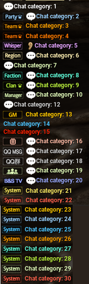

# BnsLeanPlugin

A Blade & Soul Plugin primarily developed for easy ~~teleport~~ speed and fly hacking.

## Features
- Speedhack
- Flyhack
- NoGravity
- QuickFall
- Log Player Position

## Setup
- Move plugin dll to bns plugins directory
- Create `lean.ini` in the games plugin directory.

Example .ini content found in this repo.

## Special Hotkeys
To use CTRL as Hotkey you need to set it up like this:  
hotkey = -94  
alt = 0  
shift = 0  
ctrl = 1  

## Usage Ingame
- `Alt+P`: Reload .ini configs
- `Alt+C`: Toggle `Cheater Mode`
    - Only needed once per game session. Essentially on/off switch for the plugin.
    - Only in Cheater mode it listens to fly, gravity, fall related hotkeys.
    - `Alt+N`: Print player position to your chat and current_position.ini file. ~~For teleport setup.~~
    - `user defined hotkey`: Speedhack, Flyhack, NoGravity, QuickFall

## Message Categories (06.11.2022)
- 1 Default white chat
- 2 Party blue
- 3 Alliance orange
- 4 Alliance leader dark orange
- 5 Whisper (does the sound)
- 6 Region
- 7 World chat
- 8 Faction chat
- 9 Clan chat
- 10 Manager chat
- 12 Npc text
- 13 GM message
- 14 Blue
- 15 Red
- 16 TV symbol? Peach
- 17 QQ MSG grey
- 18 QQ KR grey
- 19 Chat group? lime
- 20 B&S TV blue
- 21 System yellow
- 22 System red
- 23 System dark yellow
- 24 System light blue
- 25 System blue
- 26 System Orange
- 27 System turquoise
- 28 System Green
- 29 System Light green?
- 30 System darker Red  
